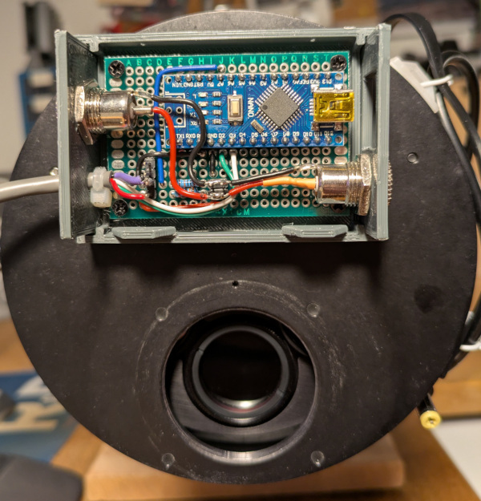

# SBIG Filter Wheel → INDI via Arduino (XAGYL Protocol)

This project allows an old **SBIG cfw8 filter wheel** to be used with INDI by inserting 
an **Arduino as a protocol and signal bridge** between the wheel and the PC.

The Arduino:
- Drives the SBIG filter wheel using **PWM pulse trains**
- Exposes a **serial interface** that speaks the **XAGYL filter wheel protocol**

This approach reuses the existing XAGYL driver already available in INDI.

**NOTE:** The Arduino reset on serial DTR sometime causes INDI to have to retry the first time it connects. [Hardware fix](https://forum.arduino.cc/t/disable-auto-reset-by-serial-connection/28248/9).

---

[SBIG protocol](docs/cfw8.hardware.pdf)

[XAGYL protocol](docs/XAGYL_protocol.pdf)

---

