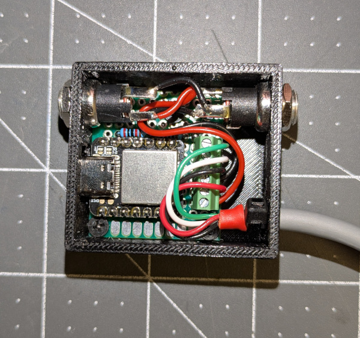
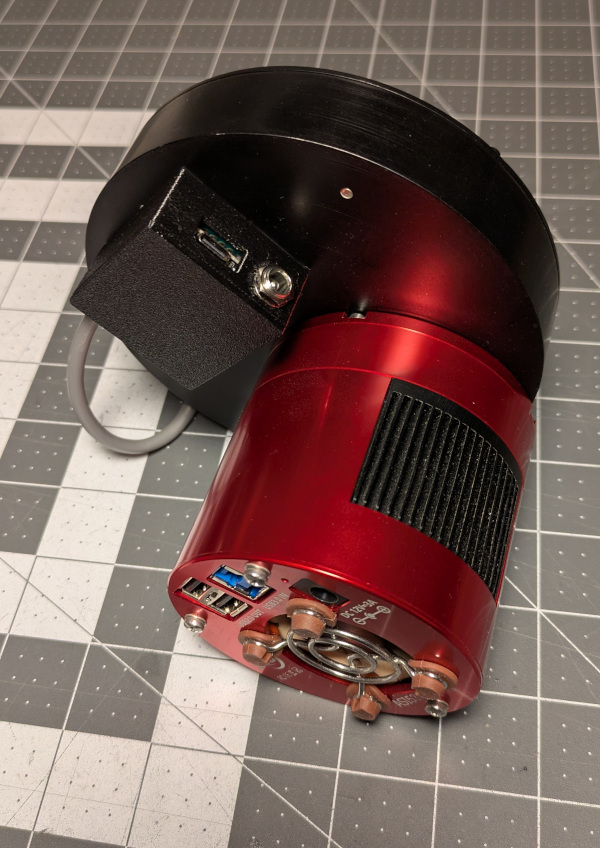

# SBIG Filter Wheel → INDI via Arduino (XAGYL Protocol)

This project allows an old **SBIG cfw8 filter wheel** to be used with INDI by inserting 
an **Arduino as a protocol and signal bridge** between the wheel and the PC.

The Arduino:
- Drives the SBIG filter wheel using **PWM pulse trains**
- Exposes a **serial interface** that speaks the **XAGYL filter wheel protocol**

This approach reuses the existing XAGYL driver already available in INDI.

**NOTE:** The Arduino Nano reset on serial DTR sometime causes INDI to have to retry the first time it connects. [Hardware fix](https://forum.arduino.cc/t/disable-auto-reset-by-serial-connection/28248/9). The SAMD21 does not seem to have this issue.

### Connections

The filter wheel requires two signal connections to the Arduino and two connections for power:

| DB-9 Pin | Wire Color   | Signal / Function                | Arduino / Notes                      |
|----------|--------------|----------------------------------|--------------------------------------|
| 1        | Green        | Move Complete                    | Connect to Arduino PIN_MOVE_COMPLETE |
| 2        | White        | Pulse Input                      | Connect to Arduino PIN_PULSE         |
| 8        | Red          | +12VDC Regulated Input (~300 mA) | Power supply input                   |
| 5        | Purple/Black | GND                              | Common GND + Arduino GND             |

**Note:** Wire colors may vary between units. Always verify the DB-9 pinout and wire colors before making connections.

### TTL vs 3.3V systems

If using SAMD21 or other 3.3V systems, the PIN_MOVE_COMPLETE must be protected using a voltage divider:

    5V TTL ── 10k ──┬── SAMD21 GPIO
                    |
                 20k|
                    |
                   GND

### Protocol documentation

[SBIG protocol](docs/cfw8.hardware.pdf)

[XAGYL protocol](docs/XAGYL_protocol.pdf)

---

